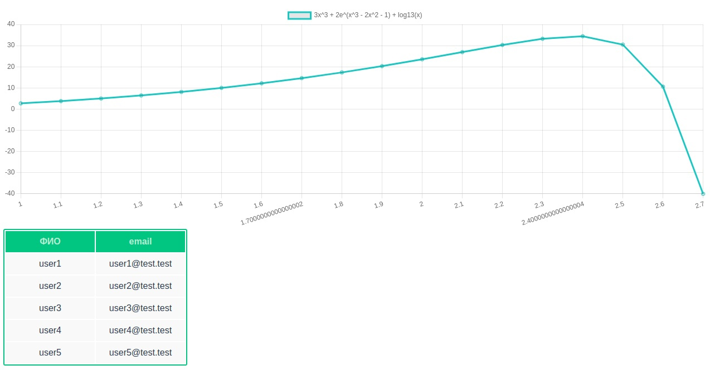
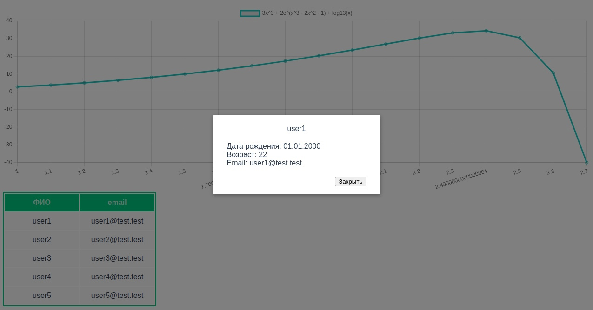

ФЕДЕРАЛЬНОЕ ГОСУДАРСТВЕННОЕ БЮДЖЕТНОЕ 

ОБРАЗОВАТЕЛЬНОЕ УЧРЕЖДЕНИЕ ВЫСШЕГО ОБРАЗОВАНИЯ

«ВЯТСКИЙ ГОСУДАРСТВЕННЫЙ УНИВЕРСИТЕТ» 

Институт математики и информационных систем

Факультет автоматики и вычислительной техники

Кафедра систем автоматизации управления

 
 
 
 
 
 
 
 
 

<strong> Отчет по лабораторной работе №5, 8 </strong>

по дисциплине

«Web-программирование»

 
 
 
 
 
 

Выполнил: студент гр. ИТб-2301-01-00 _________/Корякина К.Д./

Проверил: ст. преподаватель каф. САУ__________/Земцов М.А./

 
 
 
 
 
 
 

Киров 2022

 
 
 
 
 
 
 
 

Цель лабораторной работы: реализовать форматированный вывод данных в компонент таблица, а так же построить график заданной функции.

 

Задачи:

1)Вывести в таблицу данные, полученные с сервера с помощью библеотеки axios.

2)Организовать вывод модального окна с детализацией данных из строки.

3)Построить график заданной функции.

 

Вывести в таблицу данные, полученные с сервера с помощью библеотеки axios.

В ходе работы была реализована таблица, данные из которой были полученны с помощью get запроса к mock servers и выведены с помощью библеотеки axios.
 Результат проделанной работы представлен на рисунке 1.

Рисунок 1 - Результат работы

Организовать вывод модального окна с детализацией данных из строки.

По нажатию на любую строку таблицы происходит вывод модального окна с детализацией информации об объекте. Результат представлен на рисунке 2.

Рисунок 2 - Вывод модального окна с детализацией

Построить график заданной функции.

С помощью библеотеки Chart.js был построен график заданной функции. График представлен на рисунке 1

Вывод: в ходе работы была реализована таблица с детализацией каждой строки по нажатию, построен график функции.

